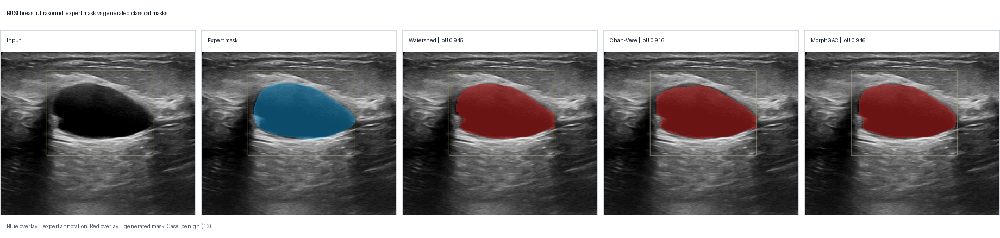
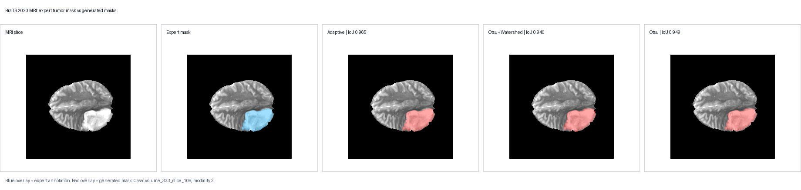
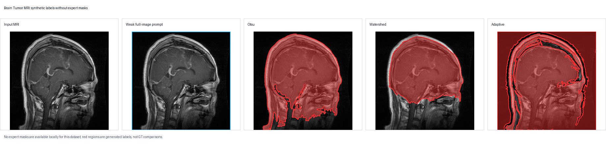

# Synthetic Oncology Segmentation Labels

Automated mask generation and YOLO segmentation-label synthesis for public oncology imaging datasets.

This repository compares classical computer vision, promptable foundation models, and learned medical segmentation networks for turning oncology images into segmentation masks and YOLO polygon labels. The project asks a practical question: can automatically generated masks reduce the amount of manual expert annotation needed to train segmentation models?

## Highlights

- **3 oncology datasets**: BUSI breast ultrasound, BraTS 2020 brain MRI, and a Brain Tumor MRI classification dataset.
- **12 mask-generation methods**: thresholding, watershed, connected components, random walker, active contours, SAM, U-Net, and Guided U-Net.
- **2 evaluation levels**:
  - Phase 1 evaluates generated masks with Dice and IoU.
  - Phase 2 trains YOLO segmentation models on generated polygon labels and evaluates box/mask mAP.
- **Best BUSI mask generator**: U-Net, **0.9517 Dice / 0.9089 IoU**.
- **Best BraTS mask generator**: Guided U-Net, **0.9195 Dice / 0.8555 IoU**.
- **Best strict BUSI downstream YOLO mask score**: YOLOv11x-seg trained on Guided U-Net labels, **0.8736 M_mAP50 / 0.6881 M_mAP50-95**.
- **Best BraTS downstream YOLO mask score**: YOLOv11x-seg trained on Guided U-Net labels, **0.6172 M_mAP50 / 0.3863 M_mAP50-95**.

## Repository Layout

```text
.
├── code/                  # Experiment runners, mask generators, training scripts
├── docs/                  # Final report and presentation
├── evaluation/            # Exploratory method-selection CSVs
├── manifests/             # Dataset manifests and small samples
├── results/
│   ├── configs/           # Run configurations
│   ├── phase1_masks/      # Main Phase 1 per-case and summary CSVs
│   ├── phase1d_training/  # U-Net and Guided U-Net training logs
│   └── phase2_yolo/       # Compact YOLO summary CSVs
├── requirements.txt
└── setup_ubuntu.sh
```

Raw datasets, prepared images, model weights, YOLO run folders, and generated polygon-label dumps are intentionally ignored. The repository keeps the code, manifests, compact CSV outputs, and final documents needed to understand and reproduce the experiments.

## Qualitative Examples

These examples show the central data flow visually: input image, expert annotation when available, and automatically generated masks.

### BUSI breast ultrasound



### BraTS 2020 brain MRI



### Brain Tumor MRI weak-label example



The Brain Tumor example has no expert mask overlay because the local dataset copy is classification-only. It is included to show the weak-label setting and why those Phase 1 Dice/IoU values are intentionally `NaN`.

## Methodology

The pipeline has two main phases.

### Phase 1: Generate and evaluate masks

Each segmentation method implements the same interface:

```python
def generate_masks(image, boxes, config):
    """Return one full-size binary mask per input box."""
```

The runner loads each image from a manifest, resolves the boxes, calls the selected method, combines the instance masks, and computes overlap metrics when ground-truth masks exist.

```text
image + boxes
-> mask generation method
-> binary instance masks
-> Dice / IoU evaluation
-> optional YOLO polygon labels
```

Phase 1 metrics:

- **Dice**: overlap metric commonly used in medical segmentation.
- **IoU**: intersection over union, a stricter overlap metric.
- **Runtime**: total method runtime in seconds.

### Phase 2: Train YOLO on generated labels

The generated binary masks are converted to YOLO segmentation polygons using OpenCV contours. YOLO models are then trained on those generated labels.

```text
generated masks
-> polygon labels
-> YOLO segmentation training
-> box mAP and mask mAP evaluation
```

Phase 2 metrics:

- **B_mAP50 / B_mAP50-95**: bounding-box quality.
- **M_mAP50 / M_mAP50-95**: segmentation-mask quality.

Since this project is about segmentation, mask mAP is the most important YOLO metric.

## Datasets

| Dataset | Modality | Task role | Ground-truth masks? |
|---|---|---|---|
| BUSI | Breast ultrasound | Direct mask evaluation and YOLO training | Yes |
| BraTS 2020 | Brain MRI slices | Direct mask evaluation and YOLO training | Yes |
| Brain Tumor MRI | Brain MRI classification folders | Synthetic-label and downstream YOLO experiments | No local segmentation masks |

The Brain Tumor dataset has no expert segmentation masks in the local copy, so Phase 1 Dice and IoU are reported as `NaN` by design. Those runs are still useful for generated-label and downstream YOLO experiments.

## Compared Mask Generators

| Family | Methods | Why included |
|---|---|---|
| Thresholding | Otsu, Multi-Otsu, Adaptive | Fast, interpretable classical baselines |
| Region/graph methods | Watershed, Connected Components, Random Walker | Classical segmentation with spatial structure |
| Active contours | Chan-Vese, Morphological GAC | Boundary/region-evolution baselines |
| Foundation model | SAM | Strong box-prompted pretrained segmentation baseline |
| Learned medical models | U-Net, Guided U-Net | Supervised biomedical segmentation baselines |

## Main Phase 1 Results

### BUSI breast ultrasound

| Rank | Method | Dice | IoU | Runtime (s) |
|---:|---|---:|---:|---:|
| 1 | U-Net | 0.9517 | 0.9089 | 121.14 |
| 2 | Guided U-Net | 0.9443 | 0.8957 | 108.09 |
| 3 | SAM | 0.8679 | 0.7767 | 241.02 |
| 4 | MorphGAC | 0.8496 | 0.7467 | 329.37 |
| 5 | Chan-Vese | 0.8144 | 0.7015 | 86.73 |
| 6 | Watershed | 0.7538 | 0.6250 | 4.84 |
| 7 | Adaptive | 0.5976 | 0.4574 | 1.60 |
| 8 | Random Walker | 0.4265 | 0.2818 | 37.17 |
| 9 | Otsu + Watershed | 0.2448 | 0.1506 | 5.21 |
| 10 | Otsu | 0.2165 | 0.1302 | 1.44 |
| 11 | Connected Components | 0.2158 | 0.1299 | 1.33 |
| 12 | Multi-Otsu | 0.0943 | 0.0522 | 2.08 |

BUSI is challenging for simple thresholding because ultrasound images have speckle noise, shadows, weak boundaries, and variable lesion contrast. Learned models and SAM handle this substantially better.

### BraTS 2020 brain MRI

| Rank | Method | Dice | IoU | Runtime (s) |
|---:|---|---:|---:|---:|
| 1 | Guided U-Net | 0.9195 | 0.8555 | 4299.70 |
| 2 | U-Net | 0.9167 | 0.8508 | 4317.35 |
| 3 | SAM | 0.7836 | 0.6576 | 9249.15 |
| 4 | Adaptive | 0.7565 | 0.6378 | 19.03 |
| 5 | Otsu + Watershed | 0.7501 | 0.6322 | 67.21 |
| 6 | Random Walker | 0.7408 | 0.6148 | 111.36 |
| 7 | Otsu | 0.7314 | 0.6142 | 18.76 |
| 8 | Connected Components | 0.7312 | 0.6140 | 19.02 |
| 9 | MorphGAC | 0.7268 | 0.6044 | 2092.41 |
| 10 | Chan-Vese | 0.7117 | 0.5994 | 870.89 |
| 11 | Watershed | 0.6274 | 0.4988 | 34.56 |
| 12 | Multi-Otsu | 0.6077 | 0.4807 | 28.11 |

BraTS is more favorable to classical methods than BUSI because MRI tumor regions can be more intensity-separable in the selected modality. Learned methods still dominate.

## U-Net Training Logs

| Run | Dataset | Model | Final val Dice | Final val IoU |
|---|---|---|---:|---:|
| U040 | BUSI | U-Net | 0.9260 | 0.8655 |
| U041 | BraTS | U-Net | 0.8844 | 0.8125 |
| U042 | BUSI | Guided U-Net | 0.9265 | 0.8670 |
| U043 | BraTS | Guided U-Net | 0.8829 | 0.8106 |

## Phase 2 YOLO Summary

| Dataset | Labels from | YOLO model | Mask mAP50 | Mask mAP50-95 |
|---|---|---|---:|---:|
| BUSI | Guided U-Net | YOLOv11x-seg | 0.8736 | 0.6881 |
| BUSI | U-Net | YOLOv26x-seg | 0.8832 | 0.6767 |
| BraTS | Guided U-Net | YOLOv11x-seg | 0.6172 | 0.3863 |
| BraTS | U-Net | YOLOv11x-seg | 0.6012 | 0.3878 |
| Brain Tumor | U-Net | YOLOv11x-seg | 0.7571 | 0.5809 |
| Brain Tumor | Guided U-Net | YOLOv11x-seg | 0.4341 | 0.2741 |

The downstream YOLO experiments show that high-quality generated labels can train usable segmentation models. The Brain Tumor results should be interpreted more carefully because direct expert segmentation masks are not available locally for Phase 1 validation.

## Installation

Create a Python environment and install the core dependencies:

```bash
python -m venv .venv
source .venv/bin/activate
pip install -r requirements.txt
```

Optional methods require additional assets:

- SAM requires a Segment Anything checkpoint and the `segment-anything` package.
- U-Net and Guided U-Net inference require trained checkpoints.
- YOLO training requires GPU access for practical runtimes.

## Data Setup

Place datasets under `data/` using the expected layout:

```text
data/
├── Dataset_BUSI_with_GT/
├── archive (1)/BraTS2020_training_data/
├── archive (1)/BraTS20 Training Metadata.csv
└── brain_tumor/archive(1)/
```

Then build manifests:

```bash
python code/build_manifests.py
```

The manifest builder writes repo-relative paths and generated prepared assets under `manifests/prepared/`, which is ignored by Git.

## Reproduce Phase 1

Run one method on a sample manifest:

```bash
python code/phase1_runner.py \
  --manifest manifests/busi_sample.csv \
  --dataset busi \
  --method watershed \
  --experiment-id E043 \
  --write-polygons
```

Run a full manifest:

```bash
python code/phase1_runner.py \
  --manifest manifests/brats.csv \
  --dataset brats \
  --method guided_unet \
  --experiment-id E063 \
  --config results/configs/E063_brats_guided_unet.json \
  --write-polygons
```

Available method names:

```text
otsu
multi_otsu
adaptive
watershed
otsu_watershed
connected
random_walker
chan_vese
morph_gac
sam
unet
guided_unet
```

## Train U-Net Models

```bash
python code/train_unet.py --help
python code/train_guided_unet.py --help
```

Training logs are stored in `results/phase1d_training/`.

## Train YOLO Segmentation Models

```bash
python code/train_yolo_phase2.py --help
```

Compact YOLO summaries are stored in `results/phase2_yolo/`.

## Key Takeaways

1. Supervised learned methods produced the best masks when ground-truth masks were available.
2. SAM was a strong no-training baseline, especially compared with simple thresholding.
3. Classical methods remain useful because they are fast, transparent, and do not require labeled training data.
4. BUSI ultrasound is much harder for threshold-based methods than BraTS MRI.
5. Synthetic labels are useful for downstream YOLO training, but their quality controls the quality of the trained model.

## Limitations

- Brain Tumor Phase 1 cannot report Dice/IoU because the local dataset does not include expert segmentation masks.
- SAM, U-Net, and YOLO experiments depend on external checkpoints, GPU availability, and optional packages.
- Medical segmentation metrics measure overlap, not clinical validity. High Dice or mAP should not be interpreted as clinical readiness.

## Documents

- Final report: [`docs/report.pdf`](docs/report.pdf)
- Presentation: [`docs/oncology-presentation.pptx`](docs/oncology-presentation.pptx)
